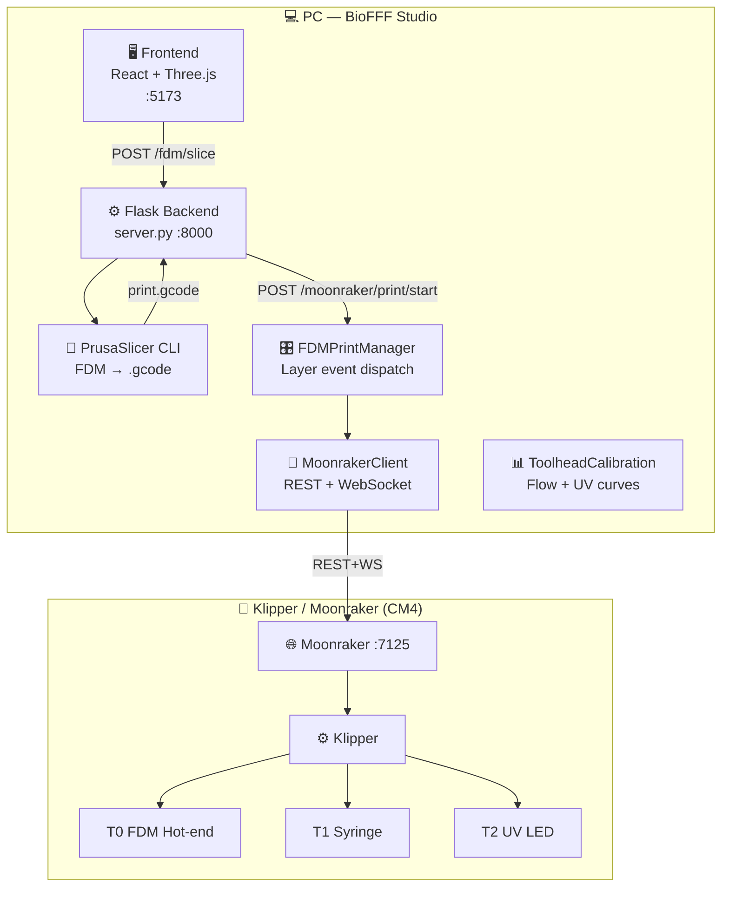

# 🧬 BioFFF Studio


**BioFFF Studio** is a multi-toolhead FDM bio-printer control station — migrated and extended from the DLP3 Bioprinter project. It supports:

- 🖨️ **T0 · FDM Hot-end** — standard filament printing (PLA, TPU, bio-compatible filaments)
- 💉 **T1 · Hydrogel Syringe** — mechanical plunger cold extrusion for bioinks and hydrogels
- ☀️ **T2 · UV Crosslinker** — 365/405 nm LED exposure for photo-crosslinking biogels per-layer

Backend: **Flask + PrusaSlicer CLI (FDM mode) + Moonraker/Klipper**

---

## ✨ What Changed vs DLP3

| Feature | DLP3 (SLA) | BioFFF (FDM) |
|---|---|---|
| Slicer engine | PrusaSlicer SLA → .sl1 | PrusaSlicer FFF → .gcode |
| Printer comm | Custom RPi Flask + projector driver | Direct Moonraker REST + WebSocket |
| Layer rendering | UV image projection | G-code execution on Klipper |
| UV crosslinking | Not available | UV head macro (UV_EXPOSE) per-layer |
| Syringe | Not available | Cold extruder T1 + calibration profile |
| Calibration | Grayscale irradiance map | Syringe flow rate + UV dose curve |

---

## 📐 Architecture



---

## 📁 New Files

| File | Purpose |
|---|---|
| `moonraker_client.py` | Direct Moonraker REST+WebSocket client |
| `fdm_print_manager.py` | FDM orchestration: layer events, toolhead switching |
| `toolhead_calibration.py` | Syringe flow rate + UV dose calibration profiles |
| `config_fdm.ini` | PrusaSlicer FFF profile (Klipper G-code flavor) |
| `klipper_configs/printer_biofff.cfg` | Full Klipper printer.cfg template with T0/T1/T2 macros |
| `components/ToolheadPanel/` | Layer schedule UI + toolhead config panel |
| `types.ts` | All new FDM/Syringe/UV TypeScript interfaces |

---

## 🚀 Quick Start

```powershell
# 1. Install Python dependencies
.\.venv\Scripts\activate
pip install flask flask-cors numpy-stl pillow requests websocket-client

# 2. Start Backend
python server.py

# 3. Start Frontend
npm run dev
```

Edit `config_fdm.ini` `[Hardware]` section to set your Moonraker IP:
```ini
[Hardware]
rpi_ip = 192.168.1.50
moonraker_port = 7125
printer_technology = FFF
```

---

## 🔌 New API Endpoints

| Method | Route | Description |
|:---:|:---|:---|
| `POST` | `/fdm/slice` | Slice STL → G-code (FFF mode) |
| `GET` | `/fdm/job/<id>/manifest` | FDM job metadata + layer count |
| `GET` | `/fdm/job/<id>/gcode` | Download generated G-code |
| `GET` | `/moonraker/status` | Moonraker + print progress |
| `POST` | `/moonraker/print/start` | Upload G-code + start print |
| `POST` | `/moonraker/print/pause` | Pause |
| `POST` | `/moonraker/print/resume` | Resume |
| `POST` | `/moonraker/print/cancel` | Cancel |
| `GET` | `/moonraker/print/state` | FDM manager state (layer, progress, toolhead) |
| `POST` | `/moonraker/gcode` | Execute arbitrary G-code |
| `POST` | `/moonraker/toolhead` | Switch toolhead by T-index |
| `POST` | `/moonraker/uv` | Trigger UV exposure |
| `POST` | `/moonraker/home` | Home axes |

---

## 🔬 Klipper Macros (in printer_biofff.cfg)

| Macro | Description |
|---|---|
| `T0` | Activate FDM extruder |
| `T1` | Activate syringe cold extruder |
| `T2` | Position UV crosslinking head |
| `UV_EXPOSE DURATION=5.0` | Fire UV LED for N seconds |
| `UV_OFF` | Turn off UV immediately |
| `SYRINGE_PRESSURIZE STEPS=50` | Pre-pressurize syringe |
| `SYRINGE_RETRACT STEPS=30` | Anti-drip retraction |
| `PRINT_START EXTRUDER_TEMP=210 BED_TEMP=60` | Full startup routine |
| `PRINT_END` | End routine + heaters off |

---

*BioFFF Studio v1.0.0 — 2026 · Migrated from DLP3 Bioprinter*
