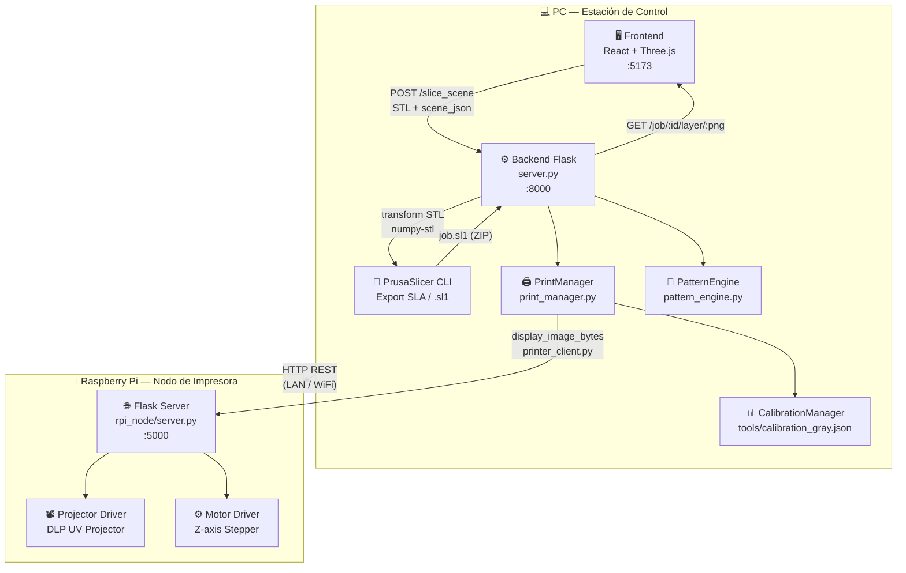
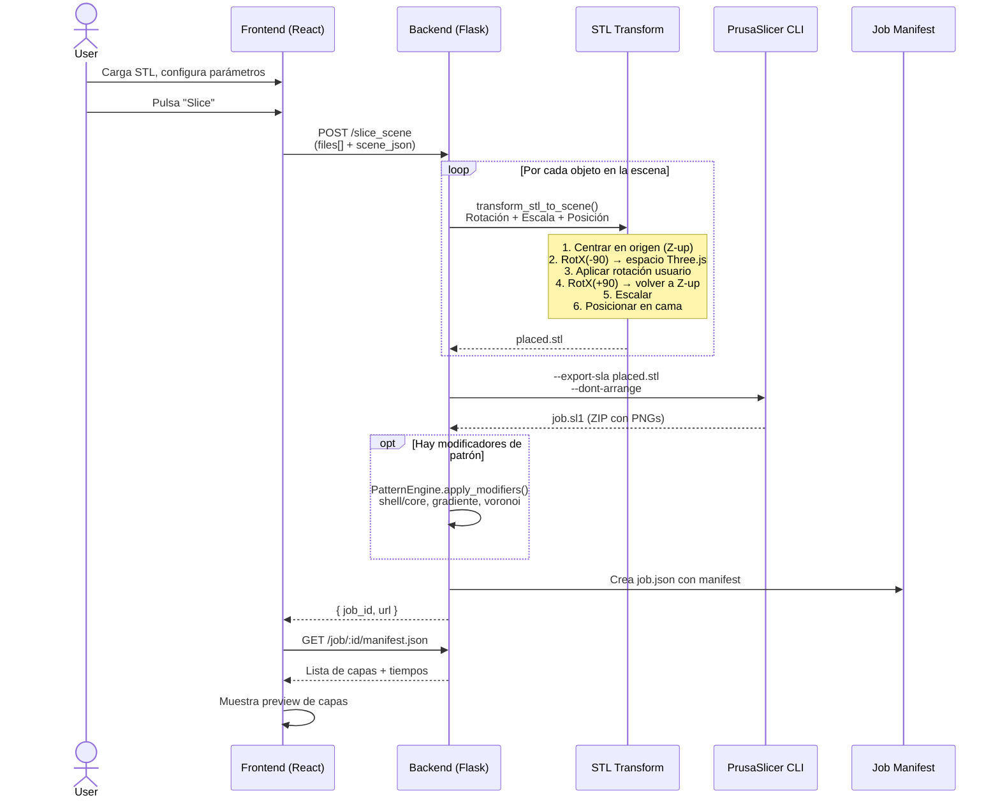
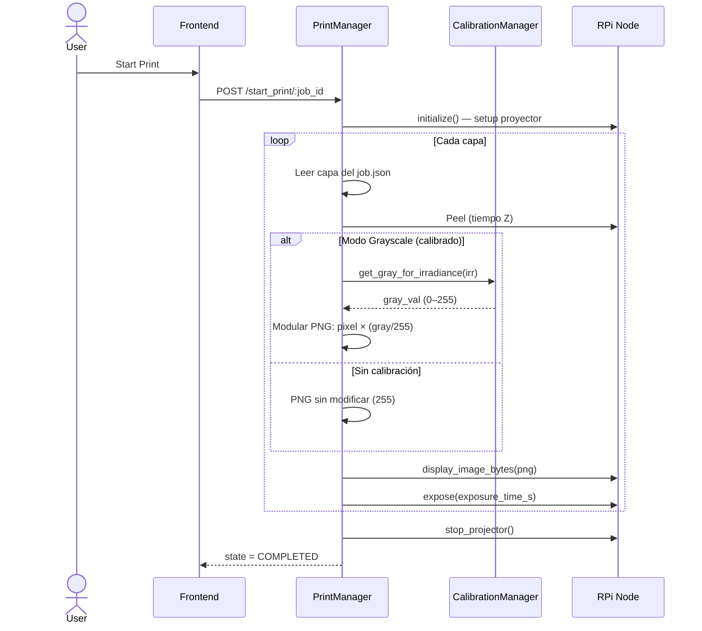
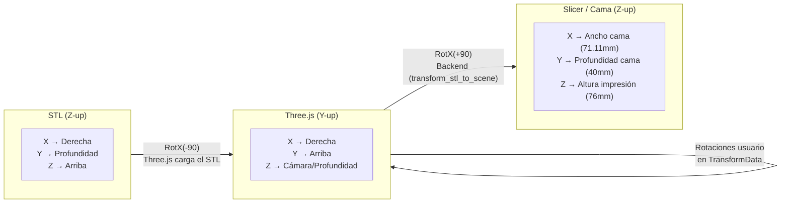
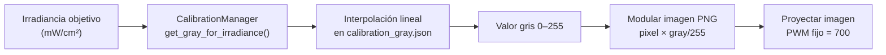
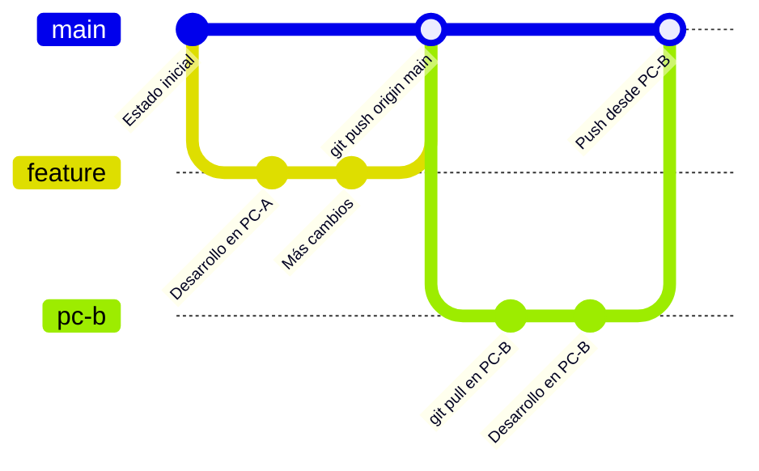

# 🧬 DLP3 Bioprinter — Control System

> Sistema de control completo para impresora DLP de bioresinas, con slicer integrado, control de irradiancia por escala de grises y monitorización en tiempo real.

---

## 📐 Arquitectura del Sistema



---

## 🔄 Flujo de Slicing



---

## 🖨️ Flujo de Impresión



---

## 🗂️ Estructura del Proyecto

```
dlp3-main/
├── 📄 server.py              # Backend Flask principal (slicing, rutas API)
├── 📄 print_manager.py       # Control de impresión + CalibrationManager
├── 📄 printer_client.py      # Cliente HTTP hacia Raspberry Pi
├── 📄 pattern_engine.py      # Motor de patrones (shell/core, voronoi, gradiente)
├── 📄 config.ini             # Configuración del slicer (dimensiones, material)
├── 📄 start.bat              # Lanzador Windows (Backend + Frontend)
│
├── 🖥️ App.tsx                # React App principal (manejo de estado global)
├── 📄 types.ts               # Interfaces TypeScript compartidas
├── 📄 index.tsx / index.html # Entry point del frontend
│
├── 📁 components/
│   ├── Viewport/
│   │   ├── Viewport.tsx      # Visor 3D (Three.js / R3F), herramientas transform
│   │   └── ModifiersPanel.tsx
│   ├── Sidebar.tsx           # Panel lateral (settings por objeto)
│   ├── LayersPanel/          # Panel de capas avanzadas
│   ├── SlicePreview.tsx      # Vista previa de capas sliceadas
│   ├── PrintMonitor.tsx      # Monitor de impresión en tiempo real
│   └── CalibrationTool.tsx   # Herramienta de calibración de irradiancia
│
├── 📁 tools/
│   ├── calibration_gray.json # Tabla irradiancia ↔ valor gris (calibración real)
│   └── calibrate_grayscale.py # Script para realizar la calibración
│
├── 📁 rpi_node/              # Código que corre en la Raspberry Pi
│   ├── server.py             # Flask API del nodo RPi (:5000)
│   ├── projector_driver.py   # Driver del proyector DLP UV
│   ├── motor_driver.py       # Driver del motor Z (stepper)
│   └── gray_scales/          # Imágenes de calibración
│
├── 📁 PrusaSlicer-2.9.3/     # Motor de slicing (no en git)
├── 📁 .venv/                 # Entorno Python (no en git)
└── 📁 node_modules/          # Dependencias Node (no en git)
```

---

## ⚙️ Sistema de Coordenadas



### Tabla de mapeo de ejes

| TransformData (Frontend) | Three.js | Slicer (Backend) |
|:---|:---:|:---:|
| `position.x` | X | X (ancho, mm) |
| `position.y` | Z | Y (profundidad, mm) |
| `position.z` | Y | Z (altura, mm) |
| `rotation.x` | rotX | rotX |
| `rotation.y` | rotZ | rotZ (swap) |
| `rotation.z` | rotY | rotY (swap) |
| `scale.x` | scaleX | scaleX |
| `scale.y` | scaleZ | scaleY (swap) |
| `scale.z` | scaleY | scaleZ (swap) |

---

## 🌡️ Calibración de Irradiancia

El proyector UV usa **escala de grises** para modular la irradiancia:



- **Rango calibrado**: 0.03 – 21.3 mW/cm²
- **Archivo de calibración**: `tools/calibration_gray.json`
- **Herramienta de calibración**: `tools/calibrate_grayscale.py`

---

## 🚀 Inicio Rápido

### 1. Primera vez en una PC nueva

```powershell
# Clonar el repositorio
git clone https://github.com/pedrorocca22/dlp3-main2.git
cd dlp3-main2

# Crear entorno Python
python -m venv .venv
.\.venv\Scripts\activate
pip install -r requirements.txt

# Instalar dependencias Node
npm install

# Copiar manualmente PrusaSlicer-2.9.3/ a la raíz del proyecto
```

### 2. Lanzar el sistema

```powershell
# Opción A: Script automático (Windows)
start.bat

# Opción B: Manual (dos terminales)
# Terminal 1 — Backend
.\.venv\Scripts\activate
python server.py

# Terminal 2 — Frontend
npm run dev
```

| Servicio | URL |
|:---|:---|
| Frontend (UI) | http://localhost:5173 |
| Backend API | http://localhost:8000 |
| RPi Node (en RPi) | http://\<rpi_ip\>:5000 |

### 3. Configurar IP de la Raspberry Pi

Editar `config.ini`, sección `[Hardware]`:
```ini
[Hardware]
rpi_ip = 192.168.137.148
```

---

## 📡 API del Backend

| Método | Ruta | Descripción |
|:---:|:---|:---|
| `GET` | `/` | Estado del servidor + dimensiones |
| `POST` | `/slice_scene` | Lanzar slicing de la escena completa |
| `GET` | `/job/<id>/manifest.json` | Manifest del trabajo (capas, tiempos) |
| `GET` | `/job/<id>/layer/<name>` | Servir PNG de capa (on-demand, desde ZIP) |
| `POST` | `/start_print/<job_id>` | Iniciar impresión |
| `POST` | `/pause_print` | Pausar impresión |
| `POST` | `/resume_print` | Reanudar impresión |
| `POST` | `/stop_print` | Detener impresión |
| `GET` | `/print_status` | Estado actual del PrintManager |
| `GET` | `/projector_info` | Info del proyector (via RPi proxy) |

---

## 📦 Dependencias

### Backend Python

| Paquete | Uso |
|:---|:---|
| `flask` + `flask-cors` | API REST |
| `numpy-stl` | Transformar geometría STL |
| `numpy` | Álgebra matricial, manipulación de imágenes |
| `Pillow` | Procesado de PNGs por capas |
| `opencv-python` | Generación de patrones (voronoi, texturas) |
| `requests` | Comunicación HTTP con Raspberry Pi |

### Frontend Node

| Paquete | Uso |
|:---|:---|
| `react` | Framework UI |
| `@react-three/fiber` + `drei` | Viewport 3D |
| `three` | Motor 3D WebGL |
| `three-stdlib` (STLLoader) | Carga de archivos STL |
| `jszip` | Lectura de archivos .sl1 en el navegador |
| `vite` | Build tool y dev server |

---

## 🔧 Dimensiones de la Máquina

| Parámetro | Valor |
|:---|:---|
| Ancho de cama (X) | 71.11 mm |
| Profundidad de cama (Y) | 40.00 mm |
| Altura máxima de impresión (Z) | 76 mm |
| Resolución proyector | 2560 × 1440 px |
| Tamaño de pixel | ~27.8 µm |
| PWM fijo (modo grayscale) | 700 |

---

## 🔄 Flujo de Trabajo Git



```powershell
# Al llegar a la PC
git pull origin main

# Al terminar el día
git add .
git commit -m "feat: descripción de los cambios"
git push origin main
```

---

*Generado el 2026-02-20 · DLP3 Bioprinter Control System*
