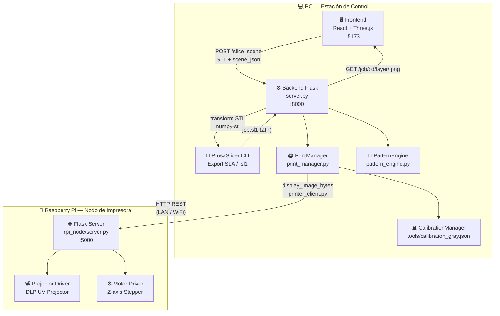
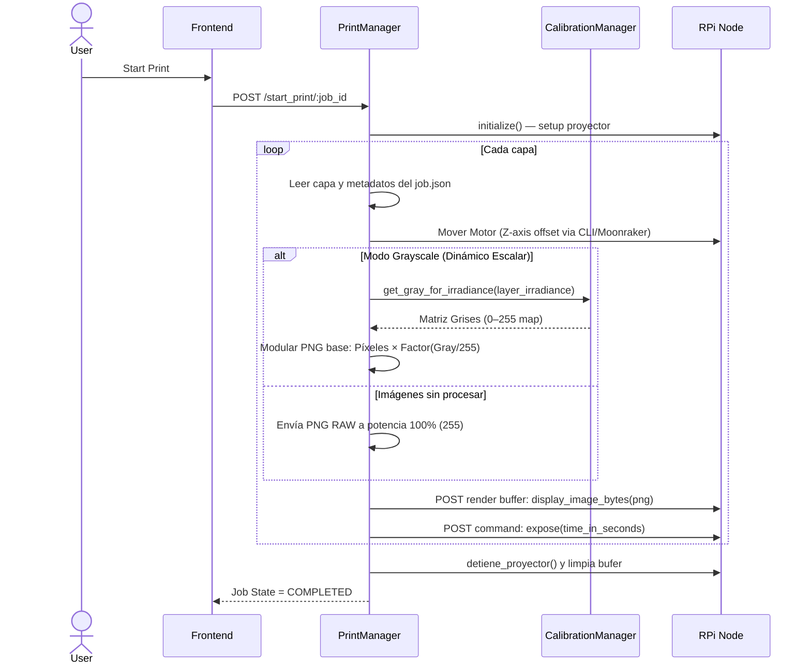
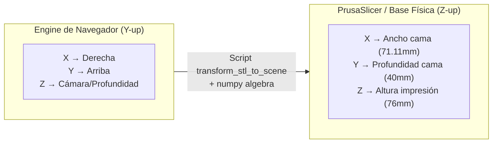

# 🧬 Bioprinting Studio DLP3 


Bienvenido al sistema **DLP3 Bioprinter**. Esta aplicación es una solución de vanguardia "Todo en Uno" (*All-in-One*) desarrollada expresamente para comandar hardware de bio-impresión 3D basado en tecnología DLP/UV. 

Ofrece un flujo de trabajo increíblemente avanzado, permitiéndote **diseñar el escenario biológico, previsualizar capas, aplicar densidades variables y controlar potencias lumínicas a nivel de píxel**, directamente desde tu navegador web.

---

## ✨ Características Principales

### 🔬 Slicer 3D Integrado (En el Navegador)
* **Visualización Dinámica:** Motor 3D basado en `Three.js` para cargar, rotar, escalar y posicionar archivos `.STL` directamente sobre la cama virtual de resina.
* **Control de Modificadores (Pattern Engine):** ¿Necesitas imprimir un hidrogel más suave en el centro y más duro en los bordes? Aplica texturas de curado como **Voronoi**, **Shell/Core**, o **Gradientes** directamente a la pieza.
* **Slicing In-Situ:** Se integra con *PrusaSlicer CLI* por debajo para procesar la geometría compleja y exportar paquetes SLA listos para impresión sin depender de otro software local.

### ☀ Calibración de Irradiancia (*Grayscale Mapping*)
* **Mapeo Dinámico de Luz:** La radiación UV no se controla por un PWM global estático, sino utilizando **mapas de escala de grises**.
* **Precisión Absoluta:** Con el controlador interpolador de 256 pasos (`calibration_gray.json`), la aplicación escala de 0.03 a 24.2 mW/cm², variando gradualmente potencias dentro de una misma capa de resina píxel a píxel.
* **Protección Celular:** El usuario declara una "Dosis Objetivo" y el algoritmo pre-calcula matemáticamente los regímenes de exposición y atenuación óptimos para las células.

---

## 📐 Arquitectura del Sistema



---

## 🖨️ Flujo Central de Impresión



---

## 🛠 Entorno e Interfaz (UI)

La ventana de **DLP3 Bioprinter** ofrece una estación de trabajo ergonómica dividida en sectores:

> **[ 1. Viewport 3D ]** - Manipulación en tiempo real de tus STL y generadores de formas biológicas.  
> **[ 2. Sidebar Properties ]** - Configuración de perfiles de resina, tiempos base y capas de control avanzadas.  
> **[ 3. Layer Explorer ]** - Control mediante slider para visualizar al milímetro **Capa por Capa** la geometría a inyectarse en el proyector.  
> **[ 4. Calibration Center ]** - Entorno para ejecutar ráfagas de pruebas test contra un radiómetro UV hasta optimizar la interpolación de luz del Hardware.

---

## 🚀 Inicio Rápido (Setup)

El sistema requiere de dos módulos en ejecución permanente en la computadora matriz de mando. Asegurate de tener asignada estáticamente la IP de la Raspberry `config.ini`.

```powershell
# Iniciar automáticamente por un Lote (Windows)
.\start.bat

# -- O manualmente abriendo dos consolas --
# Terminal 1 — Backend:
.\.venv\Scripts\activate
python server.py

# Terminal 2 — Frontend:
npm run dev
```

| Módulo Interno | Dirección Local Externa |
|:---|:---|
| Frontend (Aplicación React UI) | [http://localhost:5173](http://localhost:5173) |
| Backend Slicer API | [http://localhost:8000](http://localhost:8000) |
| Servidor Impresora (en la RPi) | `http://192.168.137.148:5000` |

---

## ⚙️ Sistema de Coordenadas

El pipeline compensa automáticamente las caídas de sistema rotacional de diseño nativo en 3D (`Three.JS`, `Y-Up`) contra el formato cartesiano maquinado GCODE (`PrusaSlicer`, `Z-Up`). El software aplica de manera invisible los remapeos de transformación: `X=X`, `Y=-Z`, `Z=Y`. 



---

## 📡 Endpoints del Backend Abiertos (REST)

| Método | Ruta | Descripción Lógica |
|:---:|:---|:---|
| `GET` | `/` | Comprobante lógico de salud del motor local |
| `POST` | `/slice_scene` | Inicia el pipeline de Fileteado (envía array JSON + STL) |
| `GET` | `/job/<id>/manifest` | Escanea un proyecto renderizado pidiendo variables temporales |
| `GET` | `/job/<id>/layer/<n>` | Carga PNG de render al DOM Frontend en caliente |
| `POST` | `/start_print/<id>` | Detona un proceso en cola por red a la Raspberry y arranca el proyector |
